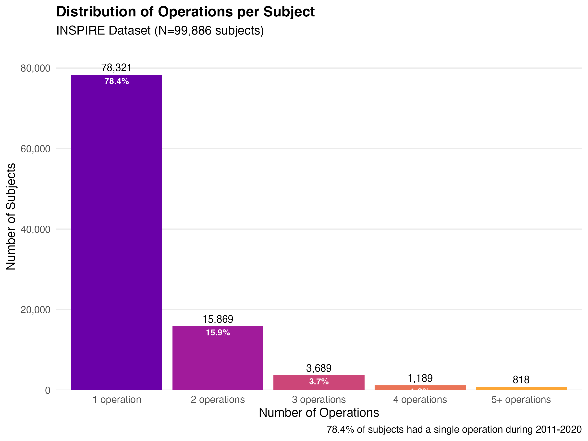
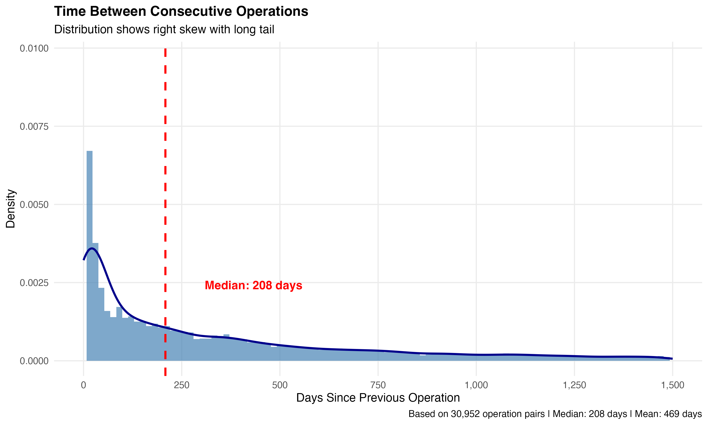
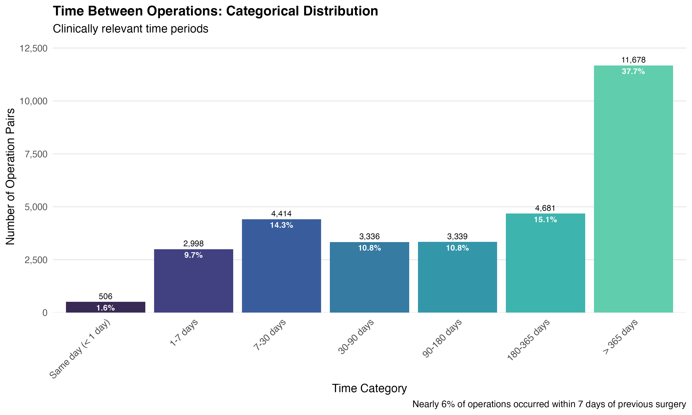

## Why This Matters

Working on large perioperative datasets can be intimidating and challenging. The INSPIRE data set has subset of patients with multiple surgeries in the data table, similar to other large datasets like NSQIP or VASQIP. Determining which patients have multiple operations is key before starting in depth analysis. This blog entry walks through the steps of EDA (exploratory data analysis) for the INSPIRE dataset.

- Need to avoid confounding from repeated surgeries
- Time between operations may indicate complications vs planned procedures
- Statistical independence assumption violated if we include all operations
- Standard approach: analyze first operation only for baseline risk prediction

## The Dataset

```{r}
#| echo: false
#| message: false
# Load required packages
library(knitr)
```

### Operations Per Subject

Most patients (78%) had a single operation, and 16% had 2 operations. A relatively small number had three or more operations, but 40% of all operations were from the multiple-surgery group.

```{r}
#| echo: false
#| message: false
#| fig-align: center
#| out-width: "80%"

```

<br>

```{r}
#| echo: false
#| message: false
#| results: asis
html_lines = readLines("../../output/01_multiple_operations/table01_operations_distribution.html")
body_start <- which(grepl("<body", html_lines))
body_end <- which(grepl("</body>", html_lines))
table_content <- html_lines[(body_start + 1):(body_end - 1)]
cat(table_content, sep = "\n")
```

**Key findings:**

- 78,321 subjects (78.4%) had a single operation
- 21,565 subjects (21.6%) had multiple operations
- 52,639 operations (40.2% of all operations) came from the multi-surgery group

We need to be cautious when examining operations in the multi-surgery group, as some may be related due to advanced illness or surgical complications. Since 40% of all operations came from the multi-surgery group, excluding them entirely would substantially reduce our sample size.

## Time Between Operations

It is important to understand the timing of multiple operations. If they are close together, they may be related. If they are far apart, it may be the same patient presenting for unrelated procedures.

### Overall Distribution

The histogram shows a notable right skew, with an early peak likely representing reoperation due to illness or complications, followed by a long tail of longer durations, likely representing unrelated surgical procedures.


```{r}
#| echo: false
#| message: false
#| fig-align: center
#| out-width: "80%"

```

<br>

```{r}
#| echo: false
#| message: false
#| results: asis
html_lines = readLines("../../output/01_multiple_operations/table02_interval_stats.html")
body_start = which(grepl("<body", html_lines))
body_end = which(grepl("</body>", html_lines))
table_content = html_lines[(body_start + 1):(body_end - 1)]
cat(table_content, sep = "\n")
```

**Key observations:**

- Median interval: 208 days (~7 months)
- Mean interval: 469 days (~15 months) - pulled up by long tail
- Wide range: some same-day, some 10 years apart

We want to exclude operations that occurred near one another (the early peak in the distribution). There appear to be operations that were sufficiently separated to be considered distinct events, but doing so would add complexity to the analysis and may be too labor-intensive to capture these isolated instances.

### Categorical Time Intervals

A significant number of the operations in the multi-surgery group happened at least one year after the other entry. 

```{r}
#| echo: false
#| message: false
#| fig-align: center
#| out-width: "80%"

```

<br>

```{r}
#| echo: false
#| message: false
#| results: asis
html_lines = readLines("../../output/01_multiple_operations/table03_interval_categories.html")
body_start <- which(grepl("<body", html_lines))
body_end <- which(grepl("</body>", html_lines))
table_content <- html_lines[(body_start + 1):(body_end - 1)]
cat(table_content, sep = "\n")
```

**30-day reoperation rate:**
- 7,925 operations (6.1% of all operations) occurred within 30 days of previous surgery
- This is a standard quality metric - typically indicates complications or urgent staged procedures

We could include operations separated by 1 year or more and be reasonably confident that we were dealing with distinct surgical events. The analysis will be more challenging when addressing these events, and the final result will add only 11,000 cases to the analysis.

## My Analysis Decision: First Operations Only

I have decided to look at the first surgery for all unique patients in the database. This will facilitate subsequent analysis. The EDA above shows that many operations in the multi-surgery group occurred one year after the preceding operations; therefore, we could revisit those cases and include them in the analysis later.

**Why first operations?**

1. Baseline risk prediction requires preoperative data only
2. Reoperation timing is unknown at time of first surgery
3. Avoids patient-level clustering (repeated measures)
4. Aligns with how risk scores are used clinically

### Creating the Analysis Cohort

Here's how we identified first operations:

```{r}
#| eval: false
#| echo: true

# Number operations chronologically for each subject
ops_sequenced <- ops %>%
  arrange(subject_id, anstart_time) %>%
  group_by(subject_id) %>%
  mutate(
    operation_number = row_number(),
    total_operations = n(),
    is_first_operation = (operation_number == 1)
  ) %>%
  ungroup()

# Filter to first operations only
first_operations <- ops_sequenced %>%
  filter(is_first_operation == TRUE)
```

### Adding Reoperation as an Outcome

While we can't use reoperation timing as a *predictor* (it's unknown before surgery), we can track it as a *postoperative outcome*:

```{r}
#| eval: false
#| echo: true

# Calculate time to second operation (if it occurred)
ops_intervals <- ops_sequenced %>%
  filter(total_operations > 1) %>%
  arrange(subject_id, operation_number) %>%
  group_by(subject_id) %>%
  mutate(
    prev_anend_time = lag(anend_time),
    days_since_prev = (anstart_time - prev_anend_time) / (60 * 24)
  ) %>%
  ungroup()

# Identify subjects with reoperation within 30 days
reoperation_30d_subjects <- ops_intervals %>%
  filter(operation_number == 2, days_since_prev < 30) %>%
  pull(subject_id)

# Add reoperation flag to first operations
first_operations <- first_operations %>%
  mutate(
    reoperation_within_30d = subject_id %in% reoperation_30d_subjects
  )
```

While a 30-day reoperation cannot be used as a predictor, it is another outcome variable we can examine when developing our predictive model.

## Summary Statistics

```{r}
#| echo: false
#| message: false
#| results: asis
html_lines = readLines("../../output/01_multiple_operations/table04_summary_statistics.html")
body_start <- which(grepl("<body", html_lines))
body_end <- which(grepl("</body>", html_lines))
table_content <- html_lines[(body_start + 1):(body_end - 1)]
cat(table_content, sep = "\n")
```

**Primary analysis cohort:**

- **99,886 first operations** (76.3% of all operations)
- One operation per subject (no repeated measures)
- Includes both single-surgery patients (78.4%) and first operation of multi-surgery patients (21.6%)

**Reoperation as outcome:**

- **5,623** subjects (**5.6%**) had reoperation within 30 days
- This will be tracked as a postoperative adverse outcome in future analyses

## Implications for Analysis

### What We're Analyzing

✅ **First operations only** (N=99,886)

- Baseline preoperative risk prediction
- No temporal confounding from previous surgeries
- Each subject appears once in the dataset

### What We're Tracking as Outcomes

We'll examine multiple postoperative outcomes:

1. **In-hospital mortality** (1.2% baseline rate)
2. **ICU admission** within 24 hours
3. **Reoperation within 30 days** (quality metric)
4. **Acute kidney injury** (KDIGO criteria or eGFR) - coming next
5. **Perioperative myocardial injury** (troponin elevation) - coming next

Using a composite outcome of adverse surgical events will increase statistical power compared with examining mortality alone. There is clinical value in examining major adverse outcomes (morbidity) in addition to mortality, with the hope that preoperative optimization could reduce both morbidity and mortality. Improving preoperative optimization has become increasingly important as we deal with an older population with more comorbidities. 

### What We're Excluding

❌ **Second and subsequent operations** (N=31,074)

- Would introduce patient-level clustering
- Reoperation timing is a postoperative variable, not preoperative
- May be analyzed separately in future work on reoperation risk

## Next Steps

**Upcoming posts:**

1. **Baseline demographics** - Characterizing the 99,886 first operations
2. **Preoperative risk prediction** - Replicating the INSPIRE authors' mortality model with proper validation
3. **Composite adverse outcomes** - Defining AKI, PMI, and combined endpoints
4. **Intraoperative data** - Adding hemodynamic features to improve prediction

## Code Availability

Full R code for this analysis: [01_multiple_operations.R](https://github.com/jimhitt/INSPIRE/blob/main/R/01_multiple_operations.R)

The analysis produces:

- 4 summary tables (HTML)
- 3 figures (PNG, 300 dpi)
- 2 analysis-ready datasets (RDS, PHI-protected)

All outputs are reproducible from the public INSPIRE dataset.

---

*This is post 2 of the INSPIRE perioperative risk prediction series. [Previous: Project Setup](../2026-02-06-starting-inspire/) | [Next: Input Variable EDA](../2026-02-09-inputVariable-EDA/)
