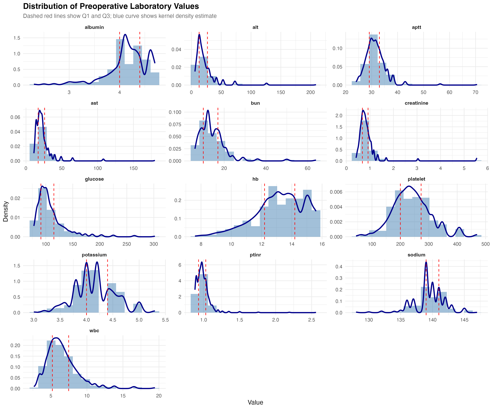
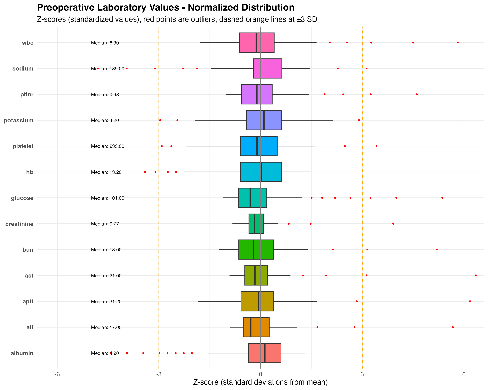

## TL;DR

- Excellent preoperative lab coverage (86-99% across 13 tests)
- Clean data with minimal outliers (most <5%)
- Using 90-day mortality (0.44%) instead of published 30-day (median death: 70 days post-op)
- First-operations cohort is healthier than published all-operations cohort
- Ready for baseline model development

## Introduction

I'm beginning my analysis by reproducing the mortality prediction models published by the INSPIRE authors. This serves two purposes: (1) validate the public dataset against published results, and (2) establish proper baselines before exploring more advanced approaches including intraoperative real-time prediction.

The original INSPIRE paper developed preoperative mortality prediction models using demographics and laboratory values, reporting an AUROC of 0.944 with gradient boosting methods. However, as we'll see, their 30-day mortality differs from what we calculate using this public dataset (which includes only first operations). I am not sure why there is a discrepancy, but it seems close enough to develop the first models.

This post documents the data quality assessment - the unglamorous but critical foundation of any healthcare ML project.

## Cohort Definition

**My approach:** First operations only (N = 97,259)

**Why first operations only?**

- Avoids statistical confounding from repeated measures on the same patients
- Represents a cleaner cohort for model development
- From the INSPIRE EDA: 21.6% of patients had multiple surgeries, accounting for 40.2% of all operations

**Published dataset:** All operations (N = 131,109)

This difference matters (all operations versus first operation), and it may explain some important discrepancies we'll discuss below.

## The 30-Day Mortality Issue

The authors' code defines the outcome as:

```python
inhosp_death_30day = (inhosp_death_time < orout_time + 30 * 24 * 60)
```

But when we examine mortality data in our data set we find:

| Statistic | Days Post-Surgery |
|-----------|-------------------|
| 25th percentile | 19 days |
| **Median** | **70 days** |
| 75th percentile | 267 days |
| Deaths beyond 30 days | 517 (66%!) |

**The reality:** Most surgical deaths occur **after 30 days**. Using a strict 30-day window misses two-thirds of mortality events.

**My decision:** Use **90-day mortality** as the primary outcome.

- Captures the median (70 days) and most events
- Clinically meaningful timeframe for mortality likely related to surgery.
- More statistical power for model development
- Honest about what we're actually predicting

## Preoperative Laboratory Coverage

The INSPIRE dataset has outstanding preoperative lab availability.

This table shows that 86-99% of operations have preoperative values for each test within the 6-month lookback window. This is typical of a well-resourced academic medical center with comprehensive preoperative evaluation protocols.

```{r}
#| echo: false
#| message: false
#| results: asis
#html_lines = readLines("../../output/02_preop_labs/table01_lab_summary.html")
#body_start <- which(grepl("<body", html_lines))
#body_end <- which(grepl("</body>", html_lines))
#table_content <- html_lines[(body_start + 1):(body_end - 1)]
#cat(table_content, sep = "\n")
```

```{=html}
<iframe src="table01_lab_summary.html" width="100%" height="800px" frameborder="0"></iframe>
```

**Key observations:**

- Creatinine: highest coverage (98.9%) - reflects routine kidney function screening
- Glucose: lowest coverage (85.9%) - still excellent
- Average 2-2.4 measurements per patient - indicates some repeat testing

## Laboratory Value Distributions

Detailed descriptive statistics for all 13 preoperative labs.

```{r}
#| echo: false
#| message: false
#| results: asis
#html_lines = readLines("../../output/02_preop_labs/table02_lab_descriptive_stats.html")
#body_start <- which(grepl("<body", html_lines))
#body_end <- which(grepl("</body>", html_lines))
#table_content <- html_lines[(body_start + 1):(body_end - 1)]
#cat(table_content, sep = "\n")
```

```{=html}
<iframe src="table02_lab_descriptive_stats.html" width="100%" height="800px" frameborder="0"></iframe>
```

**Data quality highlights:**

1. **Minimal outliers**: Most labs have <5% outliers (IQR method)
   - Exceptions: glucose (6.8%), potassium (5.7%) - expected for these variables
2. **Clinically plausible ranges**: All distributions fall within expected physiologic ranges
   - No impossible values from the percentile-binning anonymization
3. **INSPIRE's 5% percentile binning**: Values were rounded to reduce re-identification risk
   - Does NOT appear to substantially distort distributions
   - Means and medians align with clinical expectations

### Visual Distribution Assessment

Lab distributions with with kernel density estimates.

{#fig-distributions}

Distribution of preoperative laboratory values with density curves. Dashed red lines indicate Q1 and Q3. Notice the characteristic right-skew in liver enzymes (AST, ALT) and some expected bimodal patterns in glucose (diabetic vs non-diabetic patients).

This is the same data normalized to z-scores, allowing direct comparison of outlier patterns across labs.

{#fig-boxplots}

Normalized laboratory values (z-scores) showing outlier patterns. All labs are on the same scale to facilitate comparison. Reference lines at ±3 SD mark extreme outliers. Median values for each lab are shown on the left.

**Notable patterns:**

- **Albumin**: Shows widest distribution and most outliers - reflects severe illness in some patients
- **Liver enzymes** (AST, ALT): Right-skewed with long tails - typical pattern
- **Electrolytes** (Na, K): Tight distributions as expected for tightly regulated values

## Demographic and Surgical Characteristics

The full cohort characteristics.

## Demographic and Surgical Characteristics

The full cohort characteristics.
```{=html}
<iframe src="table03_demographics.html" width="100%" height="600px" frameborder="0"></iframe>
```

The 5 demographic variables used in the mortality prediction model.

```{=html}
<iframe src="table04_model_inputs.html" width="100%" height="1000px" frameborder="0"></iframe>
```

## Comparison to Published Cohort

| Characteristic | Our Cohort | Published | Difference |
|----------------|------------|-----------|------------|
| **N operations** | 97,259 | 131,109 | -33,850 (first ops only) |
| **90-day mortality** | 0.44% | 1.21%* | Lower (healthier cohort) |
| **Median age** | 55 years | 60 years | 5 years younger |
| **Emergency operations** | 6.9% | 9.4% | Less acute |

Published reports "in-hospital mortality" - actual timeframe unclear

**Why the differences?**

My **first-operations-only** approach creates a fundamentally healthier cohort:

- Younger patients (55 vs 60 years)
- Fewer emergencies (6.9% vs 9.4%)
- Lower mortality (0.44% vs 1.21%)

Patients requiring **multiple surgeries** are sicker by definition - they drive up the mortality, age, and emergency rates in the all-operations cohort, particularly when including the re-operation events.

**This is not a problem** - it's a methodological difference. My approach:

- Avoids statistical confounding from repeated measures
- Creates cleaner baseline for model development
- Clearer clinical interpretation (predicting risk from first surgical exposure)

## Key Takeaways

### What We Learned

1. **Data quality is excellent**
   - 86-99% preoperative lab coverage
   - Minimal outliers (<5% for most variables)
   - Distributions are clinically plausible

2. **The "30-day mortality" label is misleading**
   - Median time to death: 70 days
   - 66% of deaths occur after 30 days
   - We're using 90-day mortality for statistical power and honesty

3. **First operations ≠ all operations**
   - Our cohort is younger, healthier, less acute
   - Lower mortality is expected, not an error
   - Demonstrates importance of cohort selection

### What's Next

With clean data and clear outcome definitions, we're ready for:

1. **Baseline model replication** (next post)
   - Reproduce their logistic regression and XGBoost approaches
   - Proper cross-validation
   - Expected AUROC: 0.88-0.92 - we will see how it compares to the published AROC.

2. **Model comparison**
   - ASA alone (clinical baseline)
   - Demographics + labs (their approach)
   - Add intraoperative hemodynamics (our innovation)

3. **Temporal patterns with LSTM** (future)
   - Leverage 5-minute vital signs
   - Real-time risk updating during surgery

## Code Availability

All analysis code for this post is available on [GitHub](https://github.com/jimhitt/INSPIRE):

- `R/02_inputVariable_EDA.R` - Main analysis script
- `output/` - All tables and figures with `SAFE_` prefix

The INSPIRE dataset is publicly available on [PhysioNet](https://physionet.org/content/inspire/) (requires credentialing and DUA).

## Lessons for Healthcare Data Scientists

**Variable names may be misleading** Their code says `inhosp_death_30day`, but most deaths in this dataset happen at 70 days. Always examine the actual data, not just the labels. The difference may be related to analysis details or dataset differences. In this case, I decided to use 90-day mortality and stick with the initial cohort definition. The difference in mortality is partially explained by a younger and healthier cohort in our dataset.

**Data quality work is 80% of the job.** This post shows the steps to check distributions, validate calculations, and understand discrepancies. Modeling can take significant compute time, and it is important to have confidence in your input data before you start.

**Transparency builds trust.** We found discrepancies with the published data and explore these differences as we continue with the analysis. This is more valuable than hiding problems to claim perfect replication, and we may discover the reason for the difference as we complete the analysis.

*Next post: "Reproducing AUROC 0.944: What Happens with Proper Cross-Validation"*
