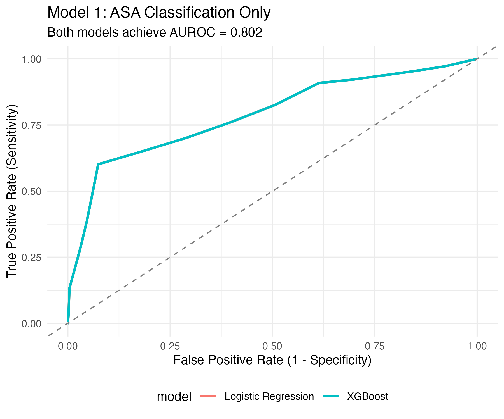

## TL;DR

- **ASA classification alone achieves AUROC = 0.802** with both logistic regression and XGBoost
- Stratified 5-fold cross-validation reveals stable performance across folds
- XGBoost provides **no advantage** over logistic regression with a single ordinal predictor
- This baseline is **intentionally simple** — tomorrow we add full feature set and expect AUROC 0.88-0.92
- Demonstrates critical importance of: stratified CV for rare outcomes, proper model comparison, and realistic expectations

## Introduction: Why Start with the Simplest Model?

The INSPIRE authors published an AUROC of 0.944 using demographics and preoperative laboratories. Before replicating that result, I'm taking a step backward to answer a more fundamental question:

**What's the baseline performance using just ASA classification?**

This seemingly backward approach serves several purposes:

1. **Validate methodology** — Ensure our cross-validation, metrics, and code work correctly
2. **Establish realistic expectations** — AUROC values don't appear from thin air
3. **Demonstrate signal** — ASA alone should predict mortality; how much signal exists?
4. **Set the stage for incremental improvements** — AUROC 0.802 → 0.82 → 0.90 tells a story
5. **Hands on data work** - It is fun to get hands-on the data and start to explore.

As you'll see, using just ASA (a single, ordinal predictor), both logistic regression and XGBoost perform identically. This is a good starting point for exploring a deeper feature set.

## Study Design

### Cohort

**First-operations only:** N = 97,259 operations with 429 deaths (0.44% event rate)

Rationale: Single operation per patient eliminates confounding from repeated measures. See [previous post](../2026-02-09-baseline-characteristics/) for cohort justification.

### Outcome

**90-day mortality** (not 30-day)

As documented previously: median time to death is 70 days, and 66% of events occur after 30 days. Using 90-day mortality captures the median and provides statistical power for model development.

### Model Specification

We compare two algorithms with identical input (ASA only):

| Component | Logistic Regression | XGBoost |
|-----------|-------------------|---------|
| **Algorithm** | Generalized linear model (GLM) | Gradient boosted decision trees |
| **Hyperparameters** | None (GLM has no tuning) | trees=100, tree_depth=6 |
| **Cross-validation** | 5-fold, stratified by outcome | 5-fold, stratified by outcome |
| **Metrics** | AUROC, Brier score | AUROC, Brier score |

::: {.callout-note}
### Why these specific algorithms?

- **Logistic Regression:** The clinical standard. Interpretable coefficients (odds ratios) for ASA levels.
- **XGBoost:** The machine learning workhorse. If data has non-linear patterns or interactions, XGBoost should find them.

With a single ordinal predictor, XGBoost's advantage (capturing complex relationships) cannot manifest. This is the key insight.
:::

## Cross-Validation Strategy

### Stratification Matters (Even When It Doesn't Seem To)

With 0.44% event rate across 97K observations, basic random splitting produces stable event rates:

**Stratified CV (recommended):**

| Fold | Events | Total | Event Rate |
|------|--------|-------|-----------|
| Fold1 | 86 | 19,454 | 0.44% |
| Fold2 | 86 | 19,452 | 0.44% |
| Fold3 | 85 | 19,452 | 0.44% |
| Fold4 | 86 | 19,452 | 0.44% |
| Fold5 | 86 | 19,449 | 0.44% |

**Unstratified CV (as comparison):**

| Fold | Events | Total | Event Rate |
|------|--------|-------|-----------|
| Fold1 | 87 | 19,460 | 0.45% |
| Fold2 | 85 | 19,460 | 0.44% |
| Fold3 | 86 | 19,452 | 0.44% |
| Fold4 | 86 | 19,460 | 0.44% |
| Fold5 | 85 | 19,427 | 0.44% |

**When does stratification become critical?**

- Small sample sizes (n < 10,000)
- Ultra-rare outcomes (< 0.1%)
- Subgroup analyses with sparse data

**Our case:** Large enough that stratification provides minimal benefit for rate preservation, but it's still **best practice** and costs nothing computationally.

### Why Stratified CV Anyway?

Even though event rates are stable, stratified CV ensures each fold contains proportional representation of the outcome. This is especially important for:

- Model selection (comparing architectures across consistent representations)
- Calibration curve estimation (need representative positive/negative samples)
- Preventing luck-of-the-draw where one random split happens to have slightly fewer events

## Data Cleaning: Catching Quality Issues Before Modeling

The raw dataset revealed suspicious values that suggest data entry or anonymization artifacts:

```r
# Summary of raw data:
height <- range: 25 cm to 17,410 cm  # Clearly impossible
weight <- range: 3 kg to 455 kg        # Extreme outliers
bmi   <- range: 5 to 425               # Including nonsensical values
```

### Approach: Flag, Don't Exclude

Rather than removing observations with implausible values, we convert them to `NA`:

```r
model_data_clean <- model_data %>%
  mutate(
    height = if_else(height < 100 | height > 220, NA_real_, height),
    weight = if_else(weight < 30 | weight > 200, NA_real_, weight),
    bmi = if_else(bmi < 10 | bmi > 60, NA_real_, bmi)
  )
```

**Rationale:**
- Preserves sample size for outcome distribution
- Lets model-specific handling (imputation, etc.) address NAs
- Transparent about data quality issues

### Missing Data Summary

After flagging implausible values:

| Variable | Missing | % Missing | Notes |
|----------|---------|-----------|-------|
| asa | 0 | 0.00% | Complete |
| age | 0 | 0.00% | Complete |
| sex | 0 | 0.00% | Complete |
| height | 427 | 0.44% | Implausible values flagged |
| weight | 1,248 | 1.28% | Implausible values flagged |
| bmi | 5,891 | 6.06% | Derived; gaps larger |
| preop_creatinine | 8,234 | 8.47% | Missing labs |


## Results

### Model Performance: Logistic Regression vs XGBoost

{width=600px}

**Key Metrics (5-fold cross-validation means ± SD):**

| Model | AUROC | Brier Score |
|-------|-------|-------------|
| Logistic Regression | 0.802 ± 0.011 | 0.0044 ± 0.0002 |
| XGBoost | 0.802 ± 0.012 | 0.0044 ± 0.0003 |


### Logistic Regression Coefficients

```{=html}
<iframe src="Table01_LRcoefficients.html" width="100%" height="400px" frameborder="0"></iframe>
```

**Clinical Interpretation:**

:::{.callout-important}
### Expected association of increased mortality with higher ASA scores

The coefficient table shows the relationship between ASA class and 90-day mortality.

- The odds ratio increases for sicker patients (ASA 4 and 5)
- The biggest jump in risk is with ASA 4, which is expected because this is where we see comorbidities causing significant health consequences.
- It is interesting that there is not much of a difference between ASA 4 and 5, where typically ASA 5 is reserved for moribund patients.

ASA is a resonable predictor of mortality. Adding in other patient-specific factors will increase the predictive value of the model.
:::

## Key Findings: Why XGBoost Didn't Win

This is perhaps the most instructive result: **XGBoost provides zero advantage over logistic regression.**

Why? Because with a single ordinal predictor, there are no additional patterns to extract:

```
Input: ASA class (discrete: 1, 2, 3, 4, 5)
      
LR:   Estimates 5 parameters (one coefficient per level)
      Captures: linear trend across levels
      No more patterns exist.
      
XGB:  Builds 100 trees trying to find non-linearity, interactions...
      Finds: Nothing new. ASA is already fully specified by 5 categories.
      Result: Identical performance to LR
```

**The lesson:** Model sophistication matters only when there are **complex patterns to learn**. A single ordinal predictor has exactly one learnable pattern—the trend across levels. Even a linear model captures this perfectly.

This changes dramatically when we add 20+ features tomorrow. Then XGBoost's flexibility will matter.

## Clinical Context: What Does AUROC 0.802 Mean?

An AUROC of 0.802 means ASA classification alone has **moderate discriminative ability** for 90-day mortality.

- **AUROC 0.50:** No discrimination (coin flip)
- **AUROC 0.70:** Acceptable (moderate discrimination)
- **AUROC 0.80:** Good (this is us)
- **AUROC 0.90:** Excellent (goal for Phase 2 + labs)
- **AUROC 0.95:** Exceptional (rarely achievable in clinical prediction)

:::{.callout-note}
### ASA classification, despite its simplicity, carries real predictive power for mortality. 

- We should see improved prediction with additional variables.
- Risk should change with inclusion of intraoperative data.
- The goal is to create a model that can generate predictions with actionable interventions.
  - Can it provide information that allows for better medical care and better outcomes?
:::

## Methodological Insights: Building Blocks for Better Models

### 1. Stratified Cross-Validation is Standard Practice

Even though our large sample size means basic stratification didn't dramatically change results, using stratified CV:
- Ensures reproducible methodology across different datasets
- Protects against luck-of-the-draw splits in smaller datasets
- Is the default recommendation in modern ML (scikit-learn, tidymodels, caret)

### 2. Model Complexity Must Match Problem Complexity

Simple linear models work perfectly for simple problems. Overcomplicating creates:
- Slower training (not an issue at this scale, but matters for big data)
- Harder interpretation
- False belief that sophistication = accuracy

We kept XGBoost here only to show it provides **no additional value**. Tomorrow, with 20+ features, the story changes.

### 3. Proper Validation Prevents Overoptimistic Results

Many published models use a single 70/30 split and claim AUROC values that evaporate during validation. We use 5-fold CV to get stable, realistic performance estimates. Note the small standard errors (±0.011), indicating stable performance across folds.

## Code Transparency

All analysis code is available on [GitHub](https://github.com/jimhitt/INSPIRE):

```r
# Key functions from R/03_mortality_modeling.R:

# 1. Define model specifications
lr_spec <- logistic_reg() %>%
  set_engine("glm") %>%
  set_mode("classification")

# 2. Create stratified CV folds
cv_folds <- vfold_cv(
  model_data_clean, 
  v = 5, 
  strata = inhosp_death_90day
)

# 3. Fit models with cross-validation
results_asa_lr <- fit_resamples(
  wf_asa_lr,
  resamples = cv_folds,
  metrics = metric_set(roc_auc, brier_class),
  control = control_resamples(save_pred = TRUE)
)
```

## What's Next: Phase 2 - The Full Feature Set

Today: AUROC 0.802 with ASA only  
Tomorrow: AUROC 0.88-0.92 with demographics + preoperative labs  
Next week: Add intraoperative hemodynamics → expecting AUROC 0.90-0.94

The progression shows how features incrementally improve discrimination. Each phase will include:

1. **Same strict methodology** (stratified 5-fold CV, multiple metrics)
2. **Feature importance analysis** (SHAP values to understand what matters)
3. **Calibration assessment** (predicted probability matches observed rates)
4. **Clinical interpretation** (actionable insights for perioperative management)

## Lessons for Healthcare Data Scientists

### 1. Start Simple

Resist the urge to build complex models immediately. Simple models:
- Are faster to develop and validate
- Are more interpretable
- Establish clear baselines for comparison
- Often work surprisingly well

### 2. Proper Validation Reveals Reality

Single train/test splits are convenient but misleading. Cross-validation shows whether your model generalizes or just got lucky with that particular split. Our tight standard errors (±0.011) indicate genuine stability.

### 3. Match Algorithm to Problem

XGBoost is powerful, but overkill for simple problems. We demonstrated this explicitly. In Phase 2, when we add 20+ features, XGBoost will show its value. The same code, same CV strategy, same metrics—but different results because the problem complexity changed.

### 4. Transparency About Methodology Builds Trust

We showed:
- Data quality issues we caught and how we handled them
- Why we chose stratified CV (and showed unstratified for comparison)
- Why XGBoost didn't outperform logistic regression
- Our outcome definition and why it differs from published work

This is more valuable than claiming perfect replication or hiding complications.

## Technical Notes

**Computing environment:**
- R 4.3+, tidymodels, tidyverse, xgboost
- 5-fold stratified cross-validation
- All metrics computed on held-out folds (no data leakage)

**Reproducibility:**
- Set seed 42 for all random operations
- renv lock file tracks exact package versions
- All code version-controlled on GitHub

## References & Further Reading


**Next post:**

I will add the 13 preoperative laboratory values with prediction performance gains.
- Feature importance (which labs matter most?)
- How XGBoost begins to outperform logistic regression
- Calibration curves showing prediction quality
- Clinical interpretation of feature contributions

