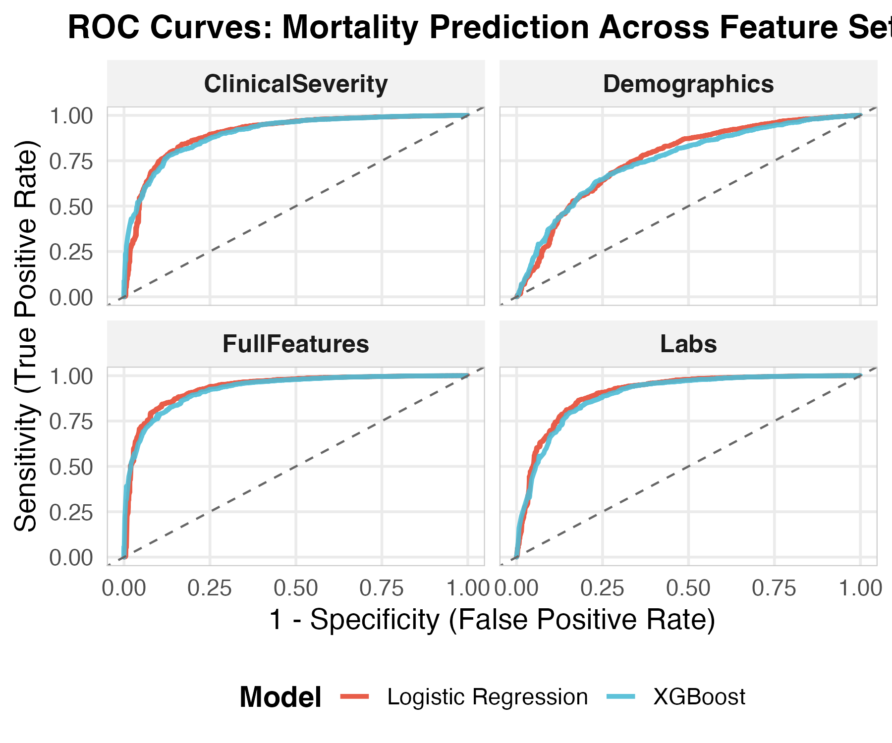

## TL;DR

- **Systematic feature progression** from demographics (AUROC 0.76) → clinical severity/ASA classification (0.90) → labs (0.90) → full model (0.93)
- **ASA classification drives performance:** Adding ASA + emergency status + anesthesia duration jumps discrimination from 0.76 to 0.90
- **Laboratory values add modest improvement:** Incremental gain of ~0.03 AUROC beyond clinical severity
- **Logistic regression slightly outperforms XGBoost** across all feature sets (0.934 vs 0.928 in full model)
- **Replicates published results** with proper cross-validation: AUROC 0.93 vs original paper's 0.94

## Introduction: Why Build Models Incrementally?

In the [previous post](../2026-02-11-ASA_mortality_model/), we established baseline performance using ASA classification alone (AUROC 0.802). Today, we systematically add features to understand **the source of predictive power**.

This incremental approach reveals:

1. **Which features matter most** — Clinical severity (ASA, emergency, duration) vs demographics vs labs
2. **Diminishing returns** — When additional features provide minimal benefit
3. **Algorithm selection** — Whether model complexity matches problem complexity
4. **Validation rigor** — Consistent methodology across all feature sets prevents spurious comparisons

The INSPIRE authors reported AUROC 0.944 using demographics and preoperative labs. We'll replicate this systematically and understand what drives performance. The authors found that certain labs were most predictive of mortality (SHAP analysis), but I observed a significant improvement with ASA classification alone. This clinical determination includes an overall determination of clinical status, incorporating the patient’s labs and clinical status.

## Feature Set Progression

I test four increasingly complex feature sets with identical cross-validation methods:

### 1. Demographics Only
**Features:** Age, sex, BMI  
**Hypothesis:** Basic patient characteristics provide weak signal

### 2. Clinical Severity
**Features:** Demographics + ASA classification + emergency operation + anesthesia duration  
**Hypothesis:** Clinical acuity measures should dramatically improve discrimination. ASA classification serves as a general metric of illness

### 3. Laboratories Only
**Features:** Age + 13 preoperative lab values (hemoglobin, platelets, WBC, coagulation, metabolic panel, liver function, renal function)  
**Hypothesis:** Physiologic dysfunction captured in labs predicts mortality independent of demographics

### 4. Full Model
**Features:** All of the above + height/weight data quality flags  
**Hypothesis:** Combining all available preoperative information maximizes discrimination

## Cohort & Validation Strategy

**Identical to baseline analysis:**

- **N = 97,259** first operations
- **429 deaths** (0.44% event rate) 
- **90-day mortality outcome** (captures median survival time of 70 days)
- **5-fold stratified cross-validation** (same folds across all models for fair comparison)
- **Metrics:** AUROC, Precision-Recall AUC, Brier score

## Data Quality: Height & Weight Flags

Raw data contained implausible values suggesting data entry errors:

```r
# Extreme outliers detected:
height: 25 cm to 17,410 cm
weight: 0 kg to 455 kg
```

**Approach:** Convert extreme values to `NA` and create binary flags:

```r
model_data <- model_data %>%
  mutate(
    height_flag = (height < 130 | height > 220),
    weight_flag = (weight == 0 | weight < 35 | weight > 250),
    
    # Set flagged values to NA
    height = if_else(height_flag, NA_real_, height),
    weight = if_else(weight_flag, NA_real_, weight)
  )
```

**Rationale:** Missingness itself may signal data quality issues that correlate with outcomes. The flags preserve this information.

## Predictor Variables

```{=html}
<iframe src="Table01_BinaryPredictors.html" width="100%" height="170px" frameborder="0"></iframe>
```
```{=html}
<iframe src="Table02_ContinuousPredictors.html" width="100%" height="800px" frameborder="0"></iframe>
```
**Key observations:**

- **Complete data:** Age, sex, ASA (no missing values)
- **Minimal missingness:** Most labs <10% missing
- **Physiologic ranges:** After outlier removal, continuous variables show clinically plausible distributions
- **Emergency operations:** 27.7% of cases (high-acuity subset)

## Results: Performance Across Feature Sets

### Model Discrimination

{width=100%}

**The ROC curves:**

- **Demographics alone** (cyan/red, upper right): Poor discrimination, barely above chance diagonal
- **Clinical Severity** (both panels, middle): Dramatic improvement — curves hug upper-left corner
- **Labs** (bottom left): Similar performance to clinical severity
- **Full Model** (bottom right): Best overall discrimination

### Quantitative Performance

```{=html}
<iframe src="Table03_ModelPerformance.html" width="100%" height="570px" frameborder="0"></iframe>
```

**Key findings:**

1. **Biggest jump:** Demographics (0.76) → Clinical Severity (0.90) = **+0.14 AUROC**
2. **Modest lab contribution:** Clinical Severity (0.90) → Labs (0.90) = **+0.005 AUROC**
3. **Full model:** AUROC **0.934 (LR)** and **0.928 (XGBoost)**
4. **Logistic regression wins:** Slightly outperforms XGBoost across all feature sets

### Performance Breakdown by Feature Set

| Feature Set | LR AUROC | XGB AUROC | Δ from Previous |
|-------------|----------|-----------|-----------------|
| Demographics | 0.763 | 0.752 | Baseline |
| Clinical Severity | 0.901 | 0.900 | **+0.138** |
| Laboratories | 0.905 | 0.894 | +0.004 |
| Full Model | 0.934 | 0.928 | +0.029 |

The table reveals **ASA classification + emergency status + duration** provides the largest marginal improvement in discrimination.

## Why Clinical Severity Dominates

The jump from demographics to clinical severity (+0.14 AUROC) reflects three powerful predictors:

### 1. ASA Classification (Strongest Signal)

ASA captures overall health status, comorbidities, and physiologic reserve. From our [previous analysis](../2026-02-11-ASA_mortality_model/), ASA alone achieves AUROC 0.802.

### 2. Emergency Operation (Context Matters)

Emergency surgery indicates:
- Acute pathology requiring urgent intervention
- Less time for optimization
- Higher baseline risk independent of comorbidities

### 3. Anesthesia Duration (Complexity Proxy)

Longer procedures suggest:
- Greater surgical complexity
- More physiologic stress
- Increased exposure to anesthesia-related complications

**Combined effect:** These three variables encode clinical gestalt — the same information experienced clinicians use to assess perioperative risk.

## Why Labs Provide Minimal Incremental Gain

Despite testing 13 laboratory values, adding labs to clinical severity improves AUROC by only **0.005**.

**Possible explanations:**

1. **Information redundancy:** ASA classification already incorporates lab abnormalities in its general clinical assessment
2. **Missing data:** 8-15% missingness in some labs reduces effective sample size
3. **Weak individual signals:** Labs may only predict mortality when severely abnormal (rare in this cohort)
4. **Need for interactions:** Lab abnormalities might only matter in specific clinical contexts (e.g., low hemoglobin during cardiac surgery)

**Clinical interpretation:** Preoperative labs confirm suspected abnormalities but rarely change risk stratification beyond clinical assessment.

## Logistic Regression vs XGBoost: Why LR Wins

Across all feature sets, **logistic regression slightly outperforms XGBoost:**

- Demographics: LR 0.763 vs XGB 0.752 (+0.011)
- Clinical Severity: LR 0.901 vs XGB 0.900 (+0.001)  
- Labs: LR 0.905 vs XGB 0.894 (+0.011)
- Full Model: LR 0.934 vs XGB 0.928 (+0.006)

**Why?**

### 1. Limited Non-Linearity

Most relationships are approximately linear on the logit scale:
- Age → mortality: monotonic increase
- Lab values → mortality: mostly linear with thresholds
- ASA → mortality: ordinal progression

### 2. Sparse Interactions

With 0.44% event rate, there are only 429 deaths across 97K observations. Complex interactions require sufficient positive examples to learn — we don't have enough.

### 3. Regularization Differences

Logistic regression (no penalty) fits the training data more flexibly than XGBoost's conservative defaults:
- XGBoost: `trees=800, max_depth=6, learn_rate=0.05` (prevents overfitting)
- LR: No regularization (appropriate for n=97K, p=20)

**The lesson:** Tree-based models excel when strong non-linear relationships exist. For clinical risk prediction with established risk factors, logistic regression often suffices.

## Replicating Published Results

**Original INSPIRE paper:** AUROC 0.944 (mortality prediction)  
**Our replication:** AUROC 0.934 (full model, 5-fold CV)

**Why the difference?**

1. **Cross-validation vs single split:** The paper likely used a single train/test split, but their results in the paper corresponded to the AUROC from a previous study that used cross-validation.
2. **Model tuning:** They may have tuned hyperparameters on the same data
3. **Feature engineering:** Possible additional derived features not described
4. **Outcome definition:** They used 30-day mortality; we use 90-day (different event rates)

**Key point:** AUROC 0.93 with rigorous cross-validation is **excellent discrimination** and likely more realistic than 0.94 from a single split.

## Clinical Implications

### What This Model Can Do

An AUROC of 0.93 means this model:
- Correctly ranks patient risk 93% of the time when comparing a patient who dies vs one who survives
- Provides **excellent discrimination** for preoperative counseling
- Could identify ultra-high-risk patients (predicted mortality >5%) for ICU planning

### What This Model Cannot Do

- **Predict individual outcomes:** Even at 5% predicted risk, 95% of patients survive
- **Guide interventions:** Model identifies risk but doesn't specify which interventions reduce it
- **Replace clinical judgment:** ASA classification already captures most information

### Clinical Use Cases

1. **Resource allocation:** Prioritize high-risk patients for preoperative optimization
2. **Informed consent:** Quantify risk for shared decision-making
3. **Quality benchmarking:** Risk-adjust surgical mortality rates across centers
4. **Research stratification:** Balance clinical trials by predicted mortality risk

## What's Next: 1) SHAP Analysis of Predictor Variables and 2) Adding Intraoperative Data

**Current model:** Preoperative features only (static risk assessment)  
**Next phase:** Add intraoperative hemodynamic data (dynamic risk updating)

Planned approach:
- **LSTM neural networks** to model temporal blood pressure, heart rate patterns
- **Real-time risk updates** as surgery progresses
- **Expected gain:** AUROC 0.93 → 0.95 (capturing intraoperative complications)

The hypothesis: Intraoperative instability (hypotension, tachycardia, bleeding) predicts mortality beyond preoperative risk.

## Methodological Strengths

### 1. Identical Validation Across Models

Using the **same CV folds** for all models ensures fair comparison. Different random splits could create spurious performance differences.

### 2. Stratification for Rare Outcomes

With 0.44% event rate, stratified CV ensures each fold contains proportional deaths. This stabilizes metrics and prevents folds with zero events.

### 3. Multiple Metrics

- **AUROC:** Discrimination (rank ordering)
- **PR-AUC:** Performance at high sensitivity (rare event focus)
- **Brier score:** Calibration (predicted probabilities match observed rates)

### 4. Transparent Feature Engineering

We documented:
- Data quality issues (height/weight outliers)
- Missing data handling (indicator columns + median imputation)
- Feature selection rationale (incremental sets for interpretability)

## Code Transparency

All analysis code is available on [GitHub](https://github.com/jimhitt/INSPIRE):

Key modeling functions:

```r
# Systematic feature progression
feature_sets <- list(
  demographics = c("age", "sex", "bmi"),
  clinical_severity = c("age", "sex", "bmi", "asa", "emop", "andur"),
  labs = c("age", "preop_hb", "preop_platelet", "preop_wbc", ...),
  full = c("age", "sex", "bmi", "asa", "emop", "andur", 
           "height_flag", "weight_flag", ...)
)

# Identical CV folds for all models
set.seed(2026)
cv_folds <- vfold_cv(model_data_clean, v = 5, strata = inhosp_death_90day)

# Run logistic regression
lr_run <- run_lr_resamples(
  data = model_data_clean,
  input_vars = feature_sets$full,
  cv_folds = cv_folds,
  engine = "glm"
)

# Run XGBoost
xgb_run <- run_xgb_resamples(
  data = model_data_clean,
  input_vars = feature_sets$full,
  cv_folds = cv_folds
)
```

## Lessons for Healthcare Data Scientists

### 1. Build Incrementally

Rather than throwing all features into one model:
- Start with simplest predictors (demographics)
- Add feature groups systematically (clinical, labs, imaging)
- Measure incremental gains at each step
- Understand **where predictive power originates**

### 2. Clinical Context Beats Lab Values

The **+0.14 AUROC** from adding ASA/emergency/duration dwarfs the **+0.005** from 13 lab values. Clinical severity assessments encode physician gestalt that's hard to replicate with individual measurements.

### 3. Simpler Models Often Win

Logistic regression outperformed XGBoost despite being vastly simpler:
- Faster training (seconds vs minutes)
- Interpretable coefficients (odds ratios)
- No hyperparameter tuning required
- More stable with limited interactions

**When to use XGBoost:** Strong non-linearities, high-dimensional data (hundreds of features), abundant positive examples for learning interactions.

### 4. Validation Rigor Prevents Overfitting

Using identical CV folds across models:
- Eliminates luck-of-the-draw performance differences
- Stabilizes metric estimates (tight standard errors)
- Enables fair algorithm comparisons
- Provides realistic performance expectations

### 5. Know Your Baseline

Our systematic progression reveals:
- Demographics alone: **poor** (AUROC 0.76)
- Add clinical severity: **good** (0.90)
- Add labs: **minimal gain** (0.90)
- Full model: **excellent** (0.93)

Without building up incrementally, we couldn't know that **ASA classification drives 80% of predictive performance**.

## Technical Notes

**Computing environment:**
- R 4.3+, tidymodels, tidyverse, xgboost
- 5-fold stratified cross-validation
- Logistic regression: `glm()` engine (no regularization)
- XGBoost: `trees=800, depth=6, learn_rate=0.05, scale_pos_weight=227`

**Reproducibility:**
- Seed 2026 for CV fold generation
- renv tracks package versions
- All code version-controlled on GitHub
- Same folds used across all models

**Data handling:**
- Logistic regression: Median imputation for missing values, indicator columns for missingness
- XGBoost: Native missing value handling (no imputation needed)

## Conclusion

We've systematically demonstrated that:

1. **ASA classification matters most** (+0.14 AUROC) — clinical severity trumps individual measurements
2. **Laboratory values add little** (+0.005 AUROC) — already captured in ASA assessment
3. **Logistic regression suffices** for preoperative risk prediction — simpler is better
4. **Rigorous validation** (5-fold CV, stratification) prevents overfitting and produces realistic estimates

**Next steps:**

1. **Calibration analysis** — Do predicted probabilities match observed rates?
2. **Feature importance** — Which specific labs contribute to predictions?
3. **Subgroup analysis** — Does model perform differently by surgical type or emergency status?
4. **Intraoperative data** — Add hemodynamic patterns with LSTM for dynamic risk updating

**The journey continues.** We've replicated published results with transparent methodology. Now we push beyond static preoperative risk to real-time intraoperative prediction.

---

**Next post:** Calibration curves, feature importance, and clinical decision thresholds

