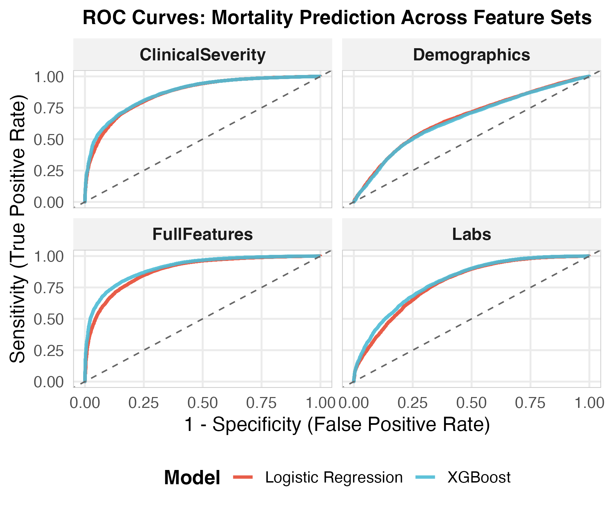

## Bottom Line Up Front

- **Composite outcome** (death, AKI, myocardial injury, prolonged ventilation) affects **5.2%** of the surgical cohort — 25 times more common than 30-day mortality alone
- **Models perform well by conventional metrics:** AUROC reaches **90.5%** (XGBoost) and **88.5%** (logistic regression) with full features; LR shows *better calibration* despite lower AUROC (Brier score 0.039 vs 0.043)
- **AUROC is not clinical utility:** At the threshold that catches 61% of events, the model generates roughly **2 false alarms for every true positive**. 5,520 false alarms and 1,964 missed cases would not help clinical decision-making.
- **"Alert fatigue" is the wrong frame:** The problem is not fatigue — it is distrust. A tool that is wrong most of the time gets ignored
- **The real clinical questions** aren't about prediction. They're about *optimization before surgery* and *management during surgery*

---

## Introduction: What We're Actually Measuring

In the [previous post](../2026-02-13-multivariate-mortality-model/), we built models predicting 30-day mortality with an AUROC of 93%. That is a good model by any academic standard. But it would have limited clinical utility for most situations, because 30-day mortality after surgery occurs in only 0.21% of cases.  Physicians would have a good sense of those high risk clinical scenarios, and we may have to proceed with the surgery if the benefits outweight the clinical risks.

This post extends that work to a composite adverse outcome: **death, acute kidney injury (AKI), perioperative myocardial injury (PMI), or prolonged mechanical ventilation.** That composite affects 5.2% of patients, which is a more meaningful clinical signal. We build the same progression of feature sets, get models with AUROC near 90%, and then ask the question the ROC curve cannot answer:

> **At any threshold you choose, is this model actually useful?**

The honest answer is: not yet, and most AI model metrics do not report clinically meaningful metrics.

---

## Composite Outcome Definition

Why these four endpoints?

```{=html}
<iframe src="Table01_OutcomeIncidence.html" width="100%" height="400px" frameborder="0"></iframe>
```

Each component captures a distinct mechanism of perioperative harm:

- **30-day mortality** (0.21%): The outcome clinicians fear most, but too rare for standalone prediction in most cohorts
- **AKI — KDIGO any stage, 7 days** (2.57%): Creatinine-based definition; patients without postoperative creatinine treated as AKI-negative (see footnote)
- **Perioperative myocardial injury** (2.24%): Peak troponin I >0.04 ng/mL within 7 days; patients without troponin assumed PMI-negative
- **Prolonged mechanical ventilation** (1.01%): Ventilator dependency beyond 24 hours after OR exit, from ward vital sign records

**ICU admission was excluded.** The INSPIRE dataset captures ICU admissions only in the first 24 hours of OR exit, which likely misses the important unplanned ICU admissions after discharge to the floor. Including planned ICU admissions would add noise, not information.

**Missing lab data requires a clinical assumption.** 65.6% of patients had no postoperative creatinine, and 95.5% had no troponin. These are not random omissions. Elective surgical patients who do well simply don't get labs ordered. And troponin tests are ordered when there is clinical suspicion of a cardiac event. Treating unmeasured patients as outcome-negative is the clinically appropriate assumption — and it is documented explicitly with `cr_measured` and `troponin_measured` flag columns in the dataset.

---

## Feature Set Progression

We test four increasingly rich feature sets with identical 5-fold stratified cross-validation, using the same folds across all models for fair comparison.

| Feature Set | Variables |
|---|---|
| **Demographics** | Age, sex, BMI |
| **Clinical Severity** | Demographics + ASA class + emergency operation + anesthesia duration |
| **Labs** | Age + 13 preoperative lab values |
| **Full Model** | All of the above + height/weight data quality flags |

The target outcome is `any_adverse_event` — a logical OR of the four components above.

```r
model_data <- model_data %>%
  mutate(
    any_adverse_event = all_death_30d | AKI_any | pmi_event | prolonged_vent
  )
```

---

## Results: The Model Performs Well

### Discrimination Across Feature Sets

{width=100%}

The ROC curves tell a familiar story:

- **Demographics alone** — modest discrimination, well below clinically useful range
- **Clinical Severity** — dramatic improvement; ASA classification and emergency status contain relevant information, similar to what we saw in the mortality prediction models
- **Labs alone** — similar performance to clinical severity; labs and ASA contain redundant information
- **Full model** — best overall discrimination at AUROC **0.905** (XGBoost) / **0.885** (logistic regression)

The pattern mirrors the mortality modeling work: ASA classification and emergency status account for the majority of discriminative power. Thirteen laboratory values add incrementally.

One result worth flagging: **logistic regression achieves a lower Brier score
(0.039 vs 0.043)**, meaning its predicted probabilities are better calibrated
to observed event rates, even though XGBoost has the higher AUROC.

These two metrics measure fundamentally different things. AUROC asks: *does the
model rank a patient who will have an adverse event above a patient who will
not?* Brier score asks: *how accurate are the predicted probabilities
themselves?* The Brier score is the mean squared error between each patient's
predicted probability and their actual outcome (1 for event, 0 for no event),
averaged across the cohort. A perfect model scores 0.0; a model that assigns
every patient the population prevalence — knowing nothing about individuals —
scores approximately 0.049 on a 5.2% event-rate problem (0.052 × 0.948 ≈
0.049). Our LR Brier score of 0.039 represents a meaningful improvement over
that naive baseline. Our XGBoost score of 0.043 is closer to it.

To make the number concrete: a Brier score of 0.039 means that on average, the
model's predicted probability is roughly off by about (√0.039 ≈ 0.20) **20%** in absolute terms.
For a patient who has an adverse event, the model might assign a probability of
0.25 when the truth is 1.0; for a patient who does not, it might assign 0.04
when the truth is 0. In a low-incidence population like this one, most patients
cluster near zero probability, so the Brier score is dominated by how well the
model behaves in that region. A model that confidently assigns low probabilities
to the 95% of patients who are fine will post a good Brier score almost by
construction — the real test is whether it pushes the 5% who will have an event
toward meaningfully higher probabilities.

By any published standard, AUROC ~0.90 is an excellent result. Now let's look at what it actually means at the bedside.

---

## The Problem: AUROC and Clinical Utility Are Different Things

AUROC measures how well a model *ranks* patients by risk — the probability that a randomly selected patient who has an adverse event receives a higher predicted risk score than a randomly selected patient who does not. That is a useful property. It is not the same as being useful.

To use a model in clinical prediction, you need to determine a threshold. It is the cutoff that converts continuous probability of an adverse event into a binary alert: *flag this patient* or *don't*.

Here is where the clinical utility of the model comes into question.

### Threshold Analysis

```{=html}
<iframe src="Table02_ConfusionMatrices.html" width="100%" height="1000px" frameborder="0"></iframe>
```

Every model in this analysis outputs a number between 0 and 1 for each patient:
the estimated probability that they will experience at least one adverse event.
That continuous score is useful for ranking, but a clinical decision support
tool needs to make a binary call — flag this patient for additional attention,
or don't. Converting a probability into an action requires choosing a
*threshold*: any patient whose predicted probability exceeds the cutoff gets
flagged; everyone below it does not. The choice of threshold is not a
statistical question. It is a clinical one, and it determines the entire
character of the tool. Set it too low and the system floods clinicians with
alerts; set it too high and it goes effectively silent. There is no objectively
correct answer — only tradeoffs that depend on the clinical context, the cost
of the intended intervention, and the relative harm of missing a true event
versus acting on a false one.

To make those tradeoffs concrete, we evaluated the XGBoost full-feature model
at three principled thresholds, each representing a different philosophy about
what the tool is for. The first prioritizes *not missing events* — it accepts a
high false-positive rate in exchange for catching most of the patients who will
have a complication. The second uses the population event rate as a natural
reference point — flag patients whose predicted risk is higher than the average
patient, a clinically intuitive standard. The third uses Youden's J, a
criterion from the statistics literature that maximizes the mathematical sum of
sensitivity and specificity simultaneously and is commonly reported as the
"optimal" threshold in clinical AI papers. Each threshold produces a different
confusion matrix: a 2×2 table that shows how the model's predictions align with
reality across the full cohort of 97,259 patients. The confusion matrix is a
more honest performance summary than any single-number metric — it forces you
to look at the false positives and false negatives together, in the actual
counts that a clinical team would face on a real surgical service.

Three operating thresholds for the XGBoost full-feature model:

**Threshold A — High Sensitivity (threshold ≈ 0.010)**  
To catch 61% of true events, the model flags an enormous number of patients. Roughly **2 false alarms for every 1 true positive** (PPV ~36%). On a busy surgical service seeing hundreds of patients, this means reviewing a large volume of alerts the majority of which are wrong.

**Threshold B — Prevalence-Based (threshold ≈ 0.050)**  
Flag patients whose predicted risk exceeds the population event rate of 5.2%. Sensitivity drops to ~39%, missing most events, but the false-positive burden decreases substantially (PPV ~56%). But it gives a false alarm nearly as often as a true alarm (not very good!). Whether that tradeoff is acceptable depends entirely on what action follows the alert, and what it costs to be wrong.

**Threshold C — Youden's J (threshold ≈ 0.990)**  
The mathematically "optimal" threshold maximizing sensitivity + specificity simultaneously. In practice, the model almost never fires (sensitivity < 1%). At 5.2% prevalence, the algorithm learns that near-silence is the safest strategy — true negatives vastly outnumber true positives, and the optimal J is achieved by calling almost nothing positive. **Youden's J is poorly suited to imbalanced outcomes.** This is a common mistake in clinical AI papers that report a single "optimal" threshold.

### No Threshold Fixes the Fundamental Problem

The right operating point depends on clinical context: specifically, the relative cost of missing a true event (false negative) versus acting on a false alarm (false positive). A screening tool for a low-cost, low-risk intervention can tolerate false positives. A tool that triggers an invasive pre-op workup or delays surgery cannot.

For a composite outcome at 5.2% incidence, no threshold produces a *trustworthy* clinical tool — one that fires selectively enough that clinicians pay attention when it does. And it may not provide additional insight to gude clinical care.

---

## "Alert Fatigue" Is the Wrong Frame

The usual explanation for why clinical decision support tools fail is "alert fatigue." The framing is that clinicians are tired, overwhelmed, desensitized by too many alerts, and start clicking through warnings reflexively.

That explanation is too kind to the tools.

Fatigue implies a problem of volume or attention. **Distrust is a problem of accuracy.** If a clinical decision support system gave me 10 carefully targeted alerts on a difficult case, where each alert increased my knowledge of the situation, I would pay attention to each one. And, I would be grateful.

When a tool alerts on 70% of the surgical schedule, the problem that arises is not *alarm fatigue*. The problem is that the tool is wrong most of the time, and physicians have learned that. Once that trust is gone, it does not come back by making the alert banner a different color.

This matters for how we evaluate clinical AI. A model with AUROC 0.90 and PPV 36% is not a model that needs better implementation or a better champion. It is a model that is not ready for clinical use at any threshold. 

---

## A Note on PR-AUC: The Metric That Looks Too Good

Our results include Precision-Recall AUC values of **0.994 (XGBoost)** and **0.992 (logistic regression)**. Those numbers are not errors. They are an artifact, and they are exactly the kind of result that should make you stop and think before using them to evaluate model performance.

### Why PR-AUC Is Misleading Here

Precision-Recall curves plot precision (PPV) on the y-axis against recall (sensitivity) on the x-axis. Area under this curve summarizes performance across all possible thresholds. When classes are balanced, PR-AUC is an informative complement to ROC-AUC.

When classes are severely imbalanced — 5.2% events, 94.8% non-events — PR-AUC inflates dramatically. Here is the key reference point: **a random classifier on an 5.2% event-rate problem has an expected PR-AUC of 0.052.** Our models report 0.994. The gap between random and our models is real — they do discriminate — but the absolute number is almost uninterpretable without that context.

The inflation happens mechanically. With many true negatives, a model that calls almost everything negative can maintain high precision at the cost of near-zero recall, producing a point in precision-recall space that looks favorable. Across many thresholds, the curve hugs the top of the plot not because the model is nearly perfect, but because the denominator of precision (predicted positives) stays small until the model is pushed to predict more positively.

**The clinically meaningful interpretation of PR-AUC is through precision itself.** If precision (PPV) at your chosen operating point is 36%, you are generating roughly 2 unnecessary alerts for every 1 actionable one. That number governs whether the tool gets used.

---

## What These Models Can Actually Do

This is not an argument that risk prediction is worthless. It is an argument that we need to start with an important clinical question, and understand the information and workflows at that decision point. Then, a model can be built that provides meaningful and actionable information (and a QI project can assess the benefits of deployment).

### Appropriate Uses for a Model at This Performance Level

**Risk stratification for resource allocation.** Not every patient needs the same level of perioperative monitoring. A model with good ranking ability, even with imperfect absolute thresholds, can help triage patients toward enhanced monitoring protocols, more intensive nursing ratios, or ICU step-down beds. The decision is continuous, not binary.

**Research stratification.** Balancing clinical trial arms by predicted risk. Adjusting for confounding in observational studies. Identifying subgroups for exploratory analysis.

**Informed consent.** Quantifying risk for shared decision-making conversations — *"your predicted risk of one of these complications is X%"* — is a legitimate use, as long as the uncertainty around that estimate is communicated clearly.

**Benchmarking.** Risk-adjusted complication rates across surgical teams, time periods, or institutions.

### What This Model Cannot Do

It cannot tell a clinician what to *do differently*. A risk score does not specify whether the intervention is more aggressive pre-op optimization, a different anesthetic technique, closer intraoperative hemodynamic monitoring, or a different surgical approach. Without an outcome-action pair — a clear intervention that follows from the prediction — a risk model is information without a plan.

---

## Where Do We Actually Need to Go?

I have been thinking about this since starting the mortality modeling work. The clinical questions I encounter at the bedside are not:

> "What is this patient's probability of having an adverse event?"

The questions are:

> "This patient has poorly controlled hypertension and moderate CKD. Can we reduce their risk by delaying surgery 6 weeks and optimizing?"

> "This patient is hypotensive during a long case. What are the implcations, and is there a management strategy that changes the risk of an adverse outcome?"

> "For this particular patient, do the risks of surgery outweigh the benefits of the procedure?"

The first two are causal inference questions — they require counterfactual reasoning, not just prediction. A model trained to predict who gets AKI cannot tell you whether optimizing blood pressure before surgery *prevents* AKI for that patient. Those are different problems that require different methods.

The third is even more complex: a decision-analytic problem with patient preferences, surgical alternatives, and downstream quality-of-life implications.

**Building accurate predictive models is the necessary precondition for that work, not the destination.** The composite outcome model we've built here is a foundation. The ROC curve tells us the signal is there. The confusion matrices tell us we have more work to do before this is ready to change clinical behavior.

Next: Can we use use intraoperative information to improve the adverse outcome risk prediction? Can use use a causal framework to establish a cause-effect relationship between intraoperative managment and postoperative adverse outcomes.

---

## Technical Notes

### Model Implementation

```r
# Outcome preparation — factor with "no" as reference level
prep_outcome <- function(df, outcome = "any_adverse_event") {
  df %>%
    mutate(
      !!outcome := factor(if_else(.data[[outcome]], "yes", "no"),
                          levels = c("no", "yes"))
    )
}

# Stratified CV folds — same folds across all models
set.seed(2026)
cv_folds <- vfold_cv(model_data_clean, v = 5, strata = any_adverse_event)

# XGBoost with class-imbalance correction
# scale_pos_weight = N_negative / N_positive
pos <- sum(model_data_clean$any_adverse_event == "yes", na.rm = TRUE)
neg <- sum(model_data_clean$any_adverse_event == "no",  na.rm = TRUE)
spw <- neg / pos   # ~8x weight on positive class
```

### Threshold Analysis Logic

```r
# Three principled thresholds
thresholds <- list(
  # 1. High sensitivity: find threshold yielding ~80% sensitivity in training data
  high_sens = quantile(preds$.pred_yes[preds$any_adverse_event == "yes"], 0.20),
  
  # 2. Prevalence-based: flag patients above population event rate
  prevalence = mean(model_data_clean$any_adverse_event == "yes"),
  
  # 3. Youden's J: maximize sensitivity + specificity
  youden = optimal_threshold_youden(preds)
)
```

**Computing environment:** R 4.3+, tidymodels, xgboost, gt  
**Reproducibility:** Seed 2026 for CV folds; renv for package versioning; code on [GitHub](https://github.com/jimhitt/INSPIRE)

---

## Conclusion

We built composite adverse outcome models that achieve AUROC ~0.90, which is reasonably good discrimination by academic standards. The confusion matrices reveal what that means in practice: at any threshold that captures a meaningful fraction of true events, the false-positive burden is high enough to undermine clinical trust.

The lesson is not that the models are failures. It is that **AUROC and clinical utility measure different things**, and we need to consider the clinical use case when evaluating a model's potential performance.

The path forward runs through causal inference — answering not *who is at risk* but *what changes the risk*. That is where we will find clinical value.

---

*Code for all analyses is available at [github.com/jimhitt/INSPIRE](https://github.com/jimhitt/INSPIRE). Data used under a Data Use Agreement with PhysioNet/INSPIRE; only aggregate statistics are reported here.*
